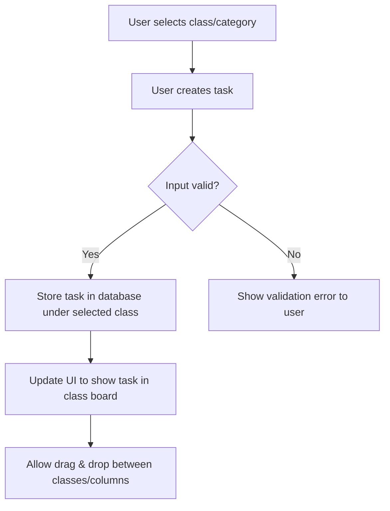
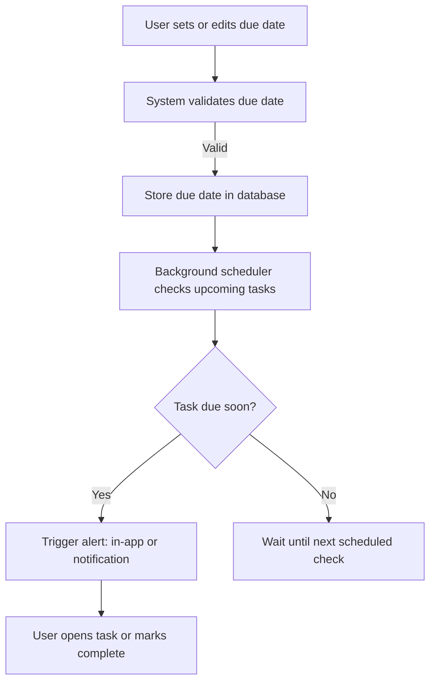

# Kibble Documentation

## 1. Overview

Kibble is a lightweight, student-focused task management application designed to help users organize their tasks by class or course and receive reminders for upcoming deadlines. The app prioritizes **core functionality and secure development practices**, ensuring that its essential features are robust, maintainable, and reliable.

This documentation focuses on the **thought process, architecture, and feature flows** behind the development of Kibble, with emphasis on the two key features:

1. Class-Based Task Categories
2. Due Date Alerts

UI/UX was secondary to feature completeness and security, and is intended for future iterations.

---

## 2. Tech Stack & Tools

- **Frontend:** Next.js, React, TypeScript, Tailwind CSS
- **Backend/API:** Next.js API Routes, Prisma ORM, PostgreSQL
- **Authentication & Security:** NextAuth.js, secure coding practices, input validation with Zod
- **Other Libraries:**
  - `@dnd-kit/core` for drag-and-drop task reordering
  - `@dnd-kit/sortable` for sortable task lists
  - Dotenv for environment variable management

**Rationale:**
Tools were selected based on task requirements, scalability, security, and personal growth. Next.js and TypeScript were chosen to align with recommended tech and to encourage development of a modern, type-safe full-stack application.

---

## 3. Architecture Overview

### High-Level Architecture

```
[Client (Browser/Next.js)]
|
v
[Next.js API Routes / Server-side Logic]
|
v
[Prisma ORM]
|
v
[PostgreSQL Database]
```

**Responsibilities:**
- **Client:** Handles UI, drag-and-drop interactions, and communicates with the API.
- **API Routes / Server:** Manages requests, input validation, business logic, and authentication.
- **Prisma:** ORM for structured database interactions.
- **Database:** Stores users, tasks, class metadata, and due dates.

Security, validation, and testable code are enforced at every layer.

---

## 4. Thought Process & Development Approach

When approaching Kibble, I followed a **principled, secure-code-first mindset**. My focus was always on developing high-quality, maintainable, and secure software, even when using a language or framework I was not yet fully fluent in — in this case, TypeScript and Next.js.

### Key Aspects:

1. **Principle-driven planning**
   - Planned the app from start to finish based on Clean Code, Secure Code, TDD, and *The Pragmatic Programmer*.
   - Mapped out internal feature workflows, validation, and database structure.

2. **Focus on key features first**
   - Primary features — **class-based task categories** and **due date alerts** — were refined before any UI/UX considerations.

3. **Tool and framework selection**
   - Selected tools based on task requirements, creativity, and personal growth (Next.js, TypeScript, Prisma, `@dnd-kit`, Zod).

4. **Iterative refinement & security-first mindset**
   - Each component was developed with maintainability, testability, and security in mind.
   - UI/UX deferred until core features were fully functional.

---

## 5. Key Feature Flows

### Flowchart 1 — Class-Based Task Categories



### Flowchart 2 — Due Date Alerts



---

## 6. Major Technical Decisions

- **Next.js with TypeScript:** Modern, full-stack framework, type safety.
- **Prisma ORM:** Type-safe database queries and schema management.
- **PostgreSQL:** Relational structure ideal for tasks, users, classes, and due dates.
- **@dnd-kit:** Lightweight, flexible drag-and-drop library for sortable boards.
- **Validation & Security:** Zod for input validation; security-first approach throughout.
- **Focus on Features:** Core functionality prioritized over UI, ensuring reliability and maintainability.

---

## 7. Setup & Deployment Overview

1. Install Node.js and PostgreSQL.
2. Clone repository: `git clone https://github.com/gluppler/Kibble.git`
3. Install dependencies: `npm install`
4. Set environment variables: `.env` (database URL, NextAuth secret, etc.)
5. Initialize database: `npx prisma migrate dev`
6. Run development server: `npm run dev`
7. Deploy: Vercel recommended for hosting (serverless-friendly Next.js deployment).

---
